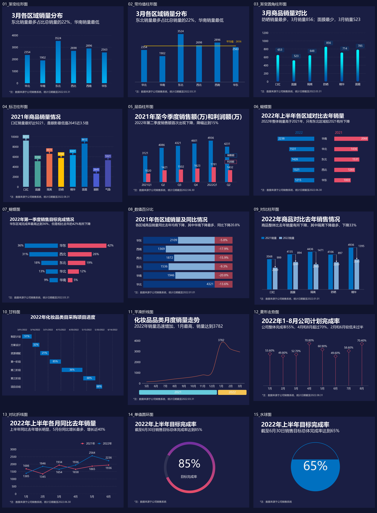
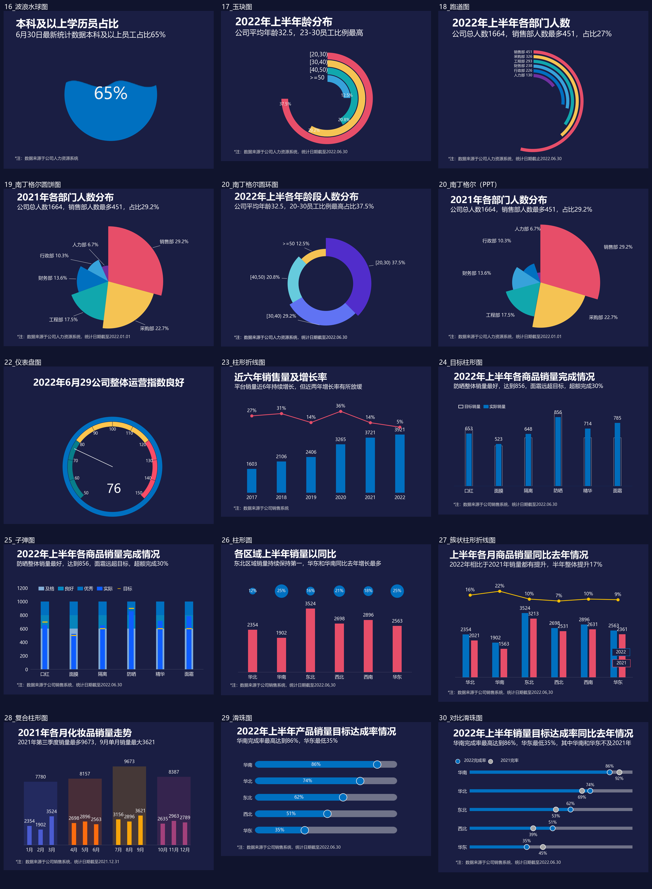

# Excel 数据可视化的 Python 复现与实践

基于郭宏远《Excel数据可视化——从图表到数据大屏》的学习实践，使用 Python 复现静态图表、动态图表，以及销售与人力资源可视化看板。

本仓库整理了复现源码、图表成果、交互页面与运行截图，展示从 Excel 图表到 Python 可视化应用的实现过程。

## 项目内容

| 模块 | 主要内容 | 展示形式 |
|---|---|---|
| 第二章：前15图 | 柱形图、折线图、甘特图、圆环图等 | PNG、SVG |
| 第二章：后15图 | 南丁格尔图、仪表盘、子弹图及组合图等 | PNG |
| 第三章：动态图表 | 动态图表与交互效果复现 | HTML |
| 第四章：数据看板 | 销售与人力资源分析 | HTML、Streamlit |

## 成果预览

### 第二章：前15图



### 第二章：后15图



### 第四章：交互看板


## 交互功能

### 销售看板

- 支持1—12月切换，联动更新销量、成本、利润及商品排名。
- 支持月份自动播放、暂停及恢复9月。
- 展示产品类别、区域、快递公司等维度的销量分布。
- 展示全年销售趋势和商品销售额 Top3。

### 人力资源看板

- 展示年龄、性别、婚姻状况、学历、部门与入转调情况。
- 支持部门和性别筛选，人数与图表同步更新。
- 支持图形悬停查看详细数值。

## 目录结构

```text
.
├── 原文件/
├── 第二章图表Python复现/
│   ├── reproduce_charts.py
│   └── 复现图表/
├── 第二章后15图Python复现/
│   ├── chart_style.py
│   ├── reproduce_charts.py
│   └── 复现图表/
├── 第三章可视化/
│   └── 网页版/
└── 第四章可视化/
    ├── 网页版/
    └── Streamlit版/
        ├── app.py
        ├── data_model.py
        ├── charts.py
        ├── Jupyter启动看板.ipynb
        ├── .streamlit/
        └── 结果截图/
```

## 如何运行

### 1. 下载项目

在仓库页面点击 **Code → Download ZIP**，下载并解压，保留原有文件夹结构。

### 2. 安装依赖

建议使用 Python 3.10 或以上版本。

运行 Streamlit 看板需要：

```bash
python -m pip install streamlit plotly openpyxl
```

如果还需要重新生成第二章的静态图表：

```bash
python -m pip install matplotlib numpy pillow
```

### 3. 启动 Streamlit 看板

在解压后的项目根目录打开终端，执行：

```bash
cd "第四章可视化/Streamlit版"
python -m streamlit run app.py
```

启动后，打开终端显示的本地网址。演示期间保持终端运行，结束时按 `Ctrl+C` 停止服务。

程序会自动查找项目中的“原文件”目录，也可以在侧栏“数据位置与刷新”中手动指定数据位置。

### 4. 在 Jupyter 中启动

打开 `Jupyter启动看板.ipynb`，将第一个单元格中的 `folder` 改为自己电脑上“Streamlit版”文件夹的实际路径，再依次运行代码单元格。

Notebook负责启动服务，看板在独立浏览器页面显示。

### 5. 查看离线网页版

下载项目后，直接用浏览器打开“网页版”目录中的 HTML 文件即可。

GitHub首页用于展示源码、说明和截图；上传仓库不会自动部署 Streamlit，也不会将本地网址变成公开演示地址。

## 代码分工

| 文件 | 作用 |
|---|---|
| `app.py` | 页面布局、筛选控件、月份切换与自动播放 |
| `data_model.py` | 读取 Excel、筛选明细与汇总统计 |
| `charts.py` | 使用 Plotly 构建图表 |
| `.streamlit/config.toml` | 页面主题与服务配置 |

`data_model.py` 和 `charts.py` 由主程序调用，不需要分别运行。

## 数据口径与复现说明

- 销售“销量”沿用原表的明细行数统计口径，不代表去重订单数或产品件数。
- 销售额和利润额以“万”为单位；成本保留源表数值。
- 原表标注的“同比”实际为月度环比，Python看板中已更正；1月缺少上年12月数据时不计算环比。
- 人员表中“专科以下”和“专科”的汇总公式引用颠倒，已按明细修正，并在看板中说明。
- 复现保留主要图型、配色与布局，同时增加适合 Python 应用的交互功能。

## 技术栈

Python · Matplotlib · NumPy · OpenPyXL · Pillow · Streamlit · Plotly · Jupyter

## 资料来源

参考资料：郭宏远《Excel数据可视化——从图表到数据大屏》。

本仓库用于记录课程学习与代码实践。原始课程资料的权利归其权利人所有，Python复现成果与原资料分目录保存。
